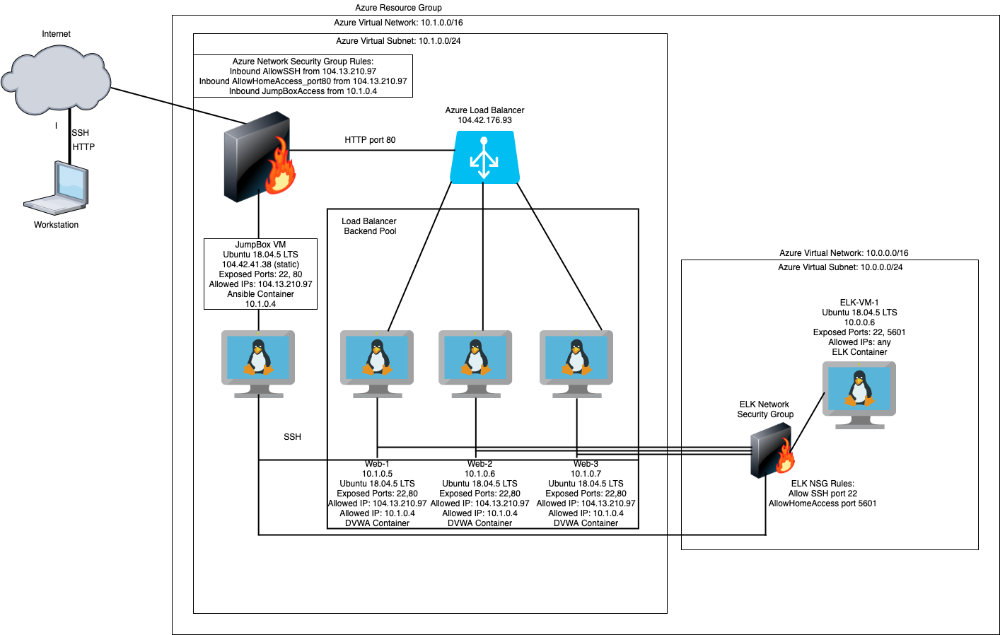
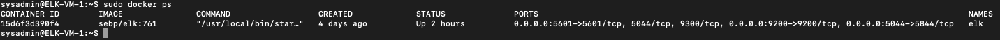
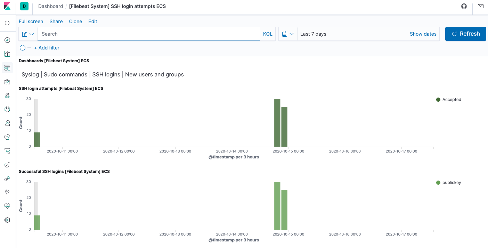

## Automated ELK Stack Deployment

The files in this repository were used to configure the network depicted below.





These files have been tested and used to generate a live ELK deployment on Azure. They can be used to recreate the entire deployment pictured above. Alternatively, select portions of the playbook file may be used to install only certain pieces of it, such as Filebeat.

This document contains the following details:
- Description of the Topology
- Access Policies
- ELK Configuration
  - Beats in Use
  - Machines Being Monitored
- DVWA Configuration 
- How to Use the Ansible Build


### Description of the Topology

The main purpose of this network is to expose a load-balanced and monitored instance of DVWA, the D*mn Vulnerable Web Application.

Load balancing ensures that the application will be highly available, in addition to restricting access to the VMs running DVWA.
- Load balancing is important for security as a defense against DDoS attacks.
- The advantage of a jump box is to have a highly-secured computer to perform admin tasks within the cloud environment so as to reduce the attack surface.

Integrating an ELK server allows users to easily monitor the vulnerable VMs for changes to the logs and system metrics.
- Filebeat monitors specified log files, collects log events, and forwards them to Logstash.
- Metricbeat collects metrics from the OS and running services and forwards them to Logstash.

The configuration details of each machine may be found below.

| Name     | Function | IP Address | Operating System |
|----------|----------|------------|------------------|
| JumpHost | Gateway  | 10.1.0.4   | Linux            |
| Web-1    | DVWA     | 10.1.0.5   | Linux            |
| Web-2    | DVWA     | 10.1.0.6   | Linux            |
| Web-3    | DVWA     | 10.1.0.7   | Linux            |
| ELK-VM   | ELK      | 10.0.0.6   | Linux            |

### Access Policies

The machines on the internal network with only private IPs are not exposed to the public Internet. Accessing the public IP of the load balancer within a browser will run the DVWA application, however.  

Only the jump box machine, the load balancer, and the ELK VM can accept connections from the Internet. Access to these machines is only allowed from the following IP addresses:

- MyPublicIP

Machines within the network can only be accessed by the jump box, which is an inbound security rule in both network security groups. 
- The jump box can connect to all the VMs on the LAN through SSH within an Ansible container with the source IP being 10.1.0.4.

A summary of the access policies in place can be found in the table below. Web-1, Web-2, and Web-3 are only publicly accessible behind a load balanacer with the IP of 104.42.176.93. Going to that IP address will launch a DVWA session within the browser. 

| Name     | Publicly Accessible | Allowed IP Addresses |
|----------|---------------------|----------------------|
| JumpHost | Yes                 | MyPublicIP           |
| Web-1    | No                  | 10.1.0.4             |
| Web-2    | No                  | 10.1.0.4             |
| Web-3    | No                  | 10.1.0.4             |
| ELK VM   | Yes                 | MyPublicIP           |

### Elk Configuration and Playbook Details

Ansible was used to automate configuration of the ELK machine. No configuration was performed manually, which is advantageous because it allows for reliable and repetitive configurations across multiple systems simultaneously.

The playbook implements the following tasks:
- Configure ELK VM with a Docker installation
- Install Python 3 pip module
- Use the pip module to install a Docker module
- Direct the ELK VM to increase virtual memory
- Download and launch a docker ELK container with published ports set to 9200, 5844, and 5601 for Elasticsearch, Logstash, and Kibana

- Two files have to be configured before running the ELK playbook: 
  - The hosts file in /etc/ansible:
    - Create an [elk] group and add the internal IP for the ELK VM along with adding the following on the same line:
      ```
      ansible_python_interpreter=/usr/bin/python3
      ```
 
  - The ansible.cfg file in /etc/ansible 
    - Search for "remote_user" in the file
    - Uncomment and add your Azure SSH login name

 - The ELK playbook file is elk-playbook.yml in the home folder of the Ansible container. 

[ELK Playbook](Ansible/elk-playbook.yml) 

- After running the playbook, navigate to the target ELK VM and run:
 $ sudo docker container list -a (to check that the installation worked as expected.)
 $ sudo docker start <Docker_container_name>
 $ sudo docker ps (to ensure that ELK is running.)

The following screenshot displays the result of running `docker ps` after successfully configuring the ELK instance.



### Target Machines & Beats
This ELK server is configured to monitor the following machines:
- 10.1.0.5, 10.1.0.6, 10.1.0.7

We have installed the following Beats on these machines:
- Filebeat
- Metricbeat

These Beats allow us to collect the following information from each machine:
- Filebeat is a logging agent that forwards logs to either Logstash or Elasticsearch.
  - Sample output found in 
  
- Metricbeat collects metrics from the OS and running services, sends them to Elasticsearch, and are visualized in Kibana.
  - Sample output found in 
    

- The 3 Web-1,2,3 VMs behind the load balancer are configured with an Ansible playbook to run DVWA. 

### Installing DVWA on Web-1, Web-2, and Web-3
 
 - Two files have to be configured before running the DVWA playbook: 
  - The hosts file in /etc/ansible:
    - Uncomment the [webservers] group and add the internal IPs for all VMs to run DVWA along with adding for each IP the following on the same line:
      ```
      ansible_python_interpreter=/usr/bin/python3
      ```

  - The ansible.cfg file in /etc/ansible 
    - Search for "remote_user" in the file
    - Uncomment and add your Azure SSH login name

- The playbook implements the following tasks:
  - Configure a [group] of Web VMs with a Docker installation
  - Install Python 3 pip module
  - Use the pip module to install a Docker module
  - Download and launch the DVWA Docker container
  - Enable the Docker service

  - The DVWA playbook dvwa-playbook.yml is located in the home directory of the Ansible container. 

 - DVWA Playbook:

 [DVWA Playbook](Ansible/dvwa-playbook.yml) 
 
- After running the playbook, navigate to the target VMs and run:
 $ sudo docker container list -a (to check that the installation worked as expected.)
 
 $ sudo docker start <Docker_container_name>

 $ sudo docker ps (to ensure that DVWA is running.)
- As a side note, the DVWA container is not designed to be attached to in the terminal. 

### Installing Filebeat and Using the Filebeat Playbook

SSH into the Ansible control node and follow the steps below:
- Navigate to https://www.elastic.co/guide/en/beats/filebeat/current/filebeat-installation-configuration.html
- Under the Step 1: Install Filebeat section, choose the DEB option and run the following lines of code in the terminal session:
```
  root@<dockerhostname># curl -L -O https://artifacts.elastic.co/downloads/beats/filebeat/filebeat-7.6.1-amd64.deb
  root@<dockerhostname># dpkg -i filebeat-7.6.1-amd64.deb
  
- Copy the config file to /etc/ansible/files
- In the Filebeat config .yml file, change the following: (this serves as a "self managed" installation.)
  - Under Elasticsearch output:
    - Uncomment and change host to <["ELKPrivateIP:9200"]>, change username if desired, and change password if desired
  - Under Kibana: 
    - Under setup:kibana:
      - Set host: <["ELKPrivateIP:5601"]>

- The playbook implements the following tasks:
  - Configure a [group] of Web VMs with a Filebeat installation
  - Copy the Filebeat config file to /etc/filebeat
  - Enable and configure the system module
  - Setup Filebeat
  - Start the Filebeat service

- The Filebeat playbook is located in ~/etc/ansible/roles.

- Filebeat Playbook Details:

[Filebeat Playbook](Ansible/filebeat-playbook.yml) 

- After running the playbook, Filebeat should be installed on all the DVWA VMs. 


### Installing Metricbeat and Using the Metricbeat Playbook

SSH into the Ansible control node and follow the steps below:
- Navigate to https://www.elastic.co/guide/en/beats/metricbeat/master/metricbeat-installation-configuration.html
- Under the Step 1: Install Metricbeat section, choose the DEB option and run the following lines of code in the terminal session:

  root@<dockerhostname># curl -L -O https://artifacts.elasticdownloads/beats/metricbeat/metricbeat-8.0.0-amd64.deb
  root@<dockerhostname># dpkg -i metricbeat-8.0.0-amd64.deb

- Suggest to keep the Metricbeat config and playbook files in the home directory, as everything is in one place
- In the metricbeat.yml config file:
  - Under setup.kibana:
    - Uncomment and set host to <["ELKPrivateIP:5601]>
  - Under Elasticsearch output:
    - Uncomment and change hosts to <["ELKPrivateIP:9200"]>

- The playbook implements the following tasks:
  - Configure a [group] of Web VMs with a Metricbeat installation
  - Copy the Metricbeat config file to /etc/metricbeat
  - Enable and configure the docker module
  - Setup Metricbeat
  - Start the Metricbeat service

- The Metricbeat playbook is located in ~/metricbeat-7.6.1-darwin-x86_6, or wherever it was downloaded. 

- Metricbeat Playbook Details: 

[Metricbeat Playbook](Ansible/metricbeat-playbook.yml) 

- After running the playbook, Metricbeat should be installed on all the DVWA VMs. 

### Final Steps

- Access the ELK machine through a browser using the public IP of the ELK VM with port 5601 specified. 


